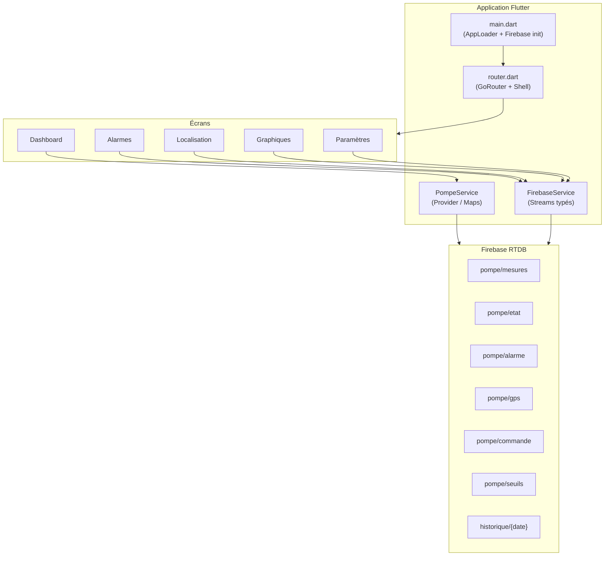

# Analyse du projet Smart_Pomp

> Document généré le 11 juin 2026 — Application de supervision de pompe solaire **SmartPumpMonitor**

---

## Vue d'ensemble

**Smart_Pomp** est une application **Flutter** nommée `smartpumpmonitor`, dédiée à la **supervision à distance d'une pompe solaire** (variateur, panneaux photovoltaïques, GPS, alarmes). Elle communique en temps réel avec un backend **Firebase Realtime Database** (`solarpumpsupervision-b0c86`, région Europe West).

L'objectif métier est clair : permettre à un opérateur de **surveiller l'état de la pompe**, consulter **mesures et historique**, gérer **alarmes**, **localiser** l'équipement et **ajuster les paramètres** du variateur.

| Information | Valeur |
|-------------|--------|
| Nom du package | `smartpumpmonitor` |
| Version | 1.0.0+1 |
| SDK Flutter | ≥ 3.0.0 < 4.0.0 |
| Projet Firebase | `solarpumpsupervision-b0c86` |
| URL RTDB | `https://solarpumpsupervision-b0c86-default-rtdb.europe-west1.firebasedatabase.app` |

---

## Stack technique

| Couche | Technologies |
|--------|-------------|
| Framework | Flutter 3.x (SDK ≥ 3.0) |
| État global | `provider` (`PompeService`) |
| Navigation | `go_router` avec barre de navigation à 5 onglets |
| Backend | Firebase Core + Realtime Database |
| Cartes | `flutter_map` + OpenStreetMap |
| Graphiques | `fl_chart` |
| Dates | `intl` |
| Notifications | `flutter_local_notifications` (préparé, non branché) |
| Liens externes | `url_launcher` |
| Plateformes | Android, iOS, Web, Windows, Linux, macOS |

### Dépendances déclarées (`pubspec.yaml`)

```yaml
dependencies:
  firebase_core: ^2.24.2
  firebase_database: ^10.4.2
  firebase_auth: ^4.16.0        # déclaré mais non utilisé
  flutter_map: ^6.1.0
  latlong2: ^0.9.0
  fl_chart: ^0.66.0
  intl: ^0.19.0
  provider: ^6.1.1
  flutter_local_notifications: ^17.0.0
  url_launcher: ^6.2.5
  equatable: ^2.0.5             # déclaré mais non utilisé
  go_router: ^17.3.0
```

---

## Architecture



### Structure des dossiers

```
Smart_Pomp/
├── lib/
│   ├── main.dart              # Point d'entrée, init Firebase, Provider
│   ├── router.dart            # Navigation principale (GoRouter)
│   ├── firebase_options.dart  # Config Firebase (Android uniquement)
│   ├── models/
│   │   ├── mesure.dart        # Mesures électriques
│   │   ├── etat.dart          # État pompe (marche, fréquence, timer)
│   │   ├── alarme.dart        # Alarmes et défauts
│   │   └── gps_data.dart      # Position GPS + opérateur SIM
│   ├── services/
│   │   ├── pompe_service.dart     # Écoute temps réel (maps brutes)
│   │   └── firebase_service.dart  # Streams typés + commandes
│   ├── screens/
│   │   ├── dashboard.dart     # Tableau de bord principal
│   │   ├── graphiques.dart      # Historique journalier
│   │   ├── alarmes.dart         # Alarmes actives
│   │   ├── localisation.dart    # Carte GPS
│   │   ├── parametres.dart      # Réglages variateur
│   │   └── timer_dialog.dart    # Dialogue minuterie (non branché)
│   ├── widgets/
│   │   ├── etat_pompe_card.dart # Contrôles marche/arrêt (non utilisé)
│   │   └── mesures_card.dart    # Carte mesures (non utilisé)
│   └── utils/
│       └── notifications.dart   # Notifications locales (non initialisé)
├── android/                   # Config Android + google-services.json
├── ios/, web/, windows/, linux/, macos/
├── test/
│   └── widget_test.dart       # Test cassé (référence classe inexistante)
├── smartpumpmonitor/          # ⚠️ Projet Flutter vierge (doublon)
└── pubspec.yaml
```

### Flux de démarrage

1. `main()` → `AppLoader` (StatefulWidget)
2. Initialisation Firebase via `DefaultFirebaseOptions.currentPlatform`
3. Écran de chargement ou gestion d'erreur Firebase
4. `MultiProvider` avec `PompeService`
5. `MaterialApp.router` avec `appRouter` (GoRouter)

### Navigation

5 onglets via `NavigationBar` dans `MainShell` :

| Route | Écran | Label |
|-------|-------|-------|
| `/dashboard` | `DashboardScreen` | Accueil |
| `/graphiques` | `GraphiquesScreen` | Graphiques |
| `/alarmes` | `AlarmesScreen` | Alarmes |
| `/localisation` | `LocalisationScreen` | GPS |
| `/parametres` | `ParametresScreen` | Paramètres |

---

## Fonctionnalités par écran

### 1. Tableau de bord (`/dashboard`)

**Service utilisé :** `PompeService` (Provider)

**Fonctionnalités :**
- Bannière d'état colorée : NORMAL (vert) / ARRÊT (gris) / ALARME (rouge)
- 4 cartes mesures sortie : tension (V), courant (A), fréquence (Hz), puissance (kW)
- Entrée panneaux solaires : tension DC, puissance
- Bloc GPS avec coordonnées et lien Google Maps
- Carte opérateur SIM (Ooredoo, Orange, Telecom Tunisie) + statut GPRS/WiFi
- Horodatage de dernière mise à jour
- Pull-to-refresh

**Données affichées (clés Firebase) :**
- `mesures.sortie_tension`, `sortie_courant`, `sortie_frequence`, `sortie_puissance`
- `mesures.tension_panneaux`, `entree_puissance`
- `gps.latitude`, `gps.longitude`, `gps.operateur`, `gps.gprs_connecte`
- `alarme.active`, `alarme.code`, `alarme.description`
- `etat.en_marche`

### 2. Graphiques (`/graphiques`)

**Service utilisé :** `FirebaseService`

**Fonctionnalités :**
- Sélection de date via `showDatePicker`
- Chargement de l'historique journalier : `historique/{yyyy-MM-dd}`
- Graphique linéaire puissance sortie (kW) — `fl_chart`
- Graphique linéaire courant sortie (A)
- Axe X : heures (0h–23h), axe Y : valeurs métriques

### 3. Alarmes (`/alarmes`)

**Service utilisé :** `FirebaseService` (StreamBuilder)

**Fonctionnalités :**
- Écoute temps réel de `pompe/alarme`
- Affichage « Aucune alarme active » si `active == false`
- Carte rouge avec : code, description, cause, solution, timestamp

### 4. Localisation (`/localisation`)

**Service utilisé :** `FirebaseService` (StreamBuilder)

**Fonctionnalités :**
- Carte interactive OpenStreetMap (`flutter_map`)
- Marqueur rouge sur la position de la pompe
- Infos : opérateur SIM, nombre de satellites, coordonnées précises
- Bouton « Ouvrir dans Google Maps »

### 5. Paramètres (`/parametres`)

**Service utilisé :** `FirebaseService`

**Fonctionnalités :**
- Lecture des seuils depuis `pompe/seuils`
- Réglage via slider pour 7 paramètres du variateur :

| Code | Description | Unité |
|------|-------------|-------|
| F14.11 | Seuil veille | V |
| F14.12 | Seuil réveil | V |
| F14.14 | Fréquence min | Hz |
| F14.17 | Courant marche à sec | A |
| F14.20 | Seuil surintensité | A |
| F14.23 | Puissance min | kW |
| F00.02 | Mode commande | — |

- Envoi commande `SET_PARAM` à Firebase
- Bouton reset variateur (paramètres usine) → commande `RESET_VARIATEUR`

---

## Modèle de données Firebase

### Arborescence RTDB

```
pompe/
├── mesures/
│   ├── tension_panneaux      (double, V)
│   ├── tension_bus_dc        (double, V)
│   ├── sortie_tension        (double, V)
│   ├── sortie_courant        (double, A)
│   ├── sortie_frequence      (double, Hz)
│   ├── sortie_puissance      (double, kW)
│   ├── entree_courant        (double, A)
│   ├── entree_puissance      (double, kW)
│   └── timestamp             (string)
│
├── etat/
│   ├── en_marche             (bool)
│   ├── frequence             (double, Hz)
│   ├── timer_actif           (bool)
│   ├── timer_reste_minutes   (int)
│   ├── timer_mode            (string: NONE, RUN, STOP)
│   └── timestamp             (string)
│
├── alarme/
│   ├── active                (bool)
│   ├── code                  (string)
│   ├── description           (string)
│   ├── cause                 (string)
│   ├── solution              (string)
│   └── timestamp             (string)
│
├── gps/
│   ├── latitude              (double)
│   ├── longitude             (double)
│   ├── valide                (bool)
│   ├── operateur             (string)
│   ├── google_maps           (string, URL)
│   ├── gprs_connecte         (bool)
│   ├── altitude              (double, optionnel)
│   ├── vitesse               (double, optionnel)
│   ├── satellites            (int, optionnel)
│   └── timestamp             (string)
│
├── commande/
│   ├── ordre                 (string)
│   ├── statut                (string: EN_ATTENTE)
│   ├── timestamp             (string / ServerValue)
│   └── ...extras             (frequence, timer_heures, parametre, etc.)
│
└── seuils/
    ├── veille                (int)
    ├── reveil                (int)
    ├── basse_freq            (int)
    ├── marche_sec            (int)
    ├── surintensite          (int)
    └── puiss_min             (int)

historique/
└── {yyyy-MM-dd}/
    └── {heure}/              (0–23)
        ├── puissance_sortie  (double)
        └── courant_sortie    (double)
```

### Commandes distantes supportées

| Ordre | Description | Extras |
|-------|-------------|--------|
| `START` | Démarrer la pompe | — |
| `STOP` | Arrêter la pompe | — |
| `SET_FREQ` | Régler la fréquence | `frequence` |
| `RESET_VARIATEUR` | Reset paramètres usine | — |
| `TIMER_RUN` | Marche puis arrêt auto | `timer_heures`, `timer_minutes` |
| `TIMER_STOP` | Arrêt temporaire | `timer_heures`, `timer_minutes` |
| `TIMER_OFF` | Annuler minuterie | — |
| `SET_PARAM` | Modifier un paramètre | `parametre`, `valeur` |

---

## Modèles Dart

### `Mesure`
Représente les mesures électriques (entrée/sortie panneaux et variateur).

### `EtatPompe`
État opérationnel : marche/arrêt, fréquence consigne, minuterie active.

### `Alarme`
Défaut actif avec code, description, cause, solution recommandée.

### `GPSData`
Position géographique, validité, opérateur SIM, lien Google Maps.

---

## Services — Analyse détaillée

### `PompeService` (ChangeNotifier)

- **Utilisé par :** Dashboard uniquement
- **Pattern :** Maps brutes (`Map<String, dynamic>`)
- **Connexion :** URL RTDB explicite via `FirebaseDatabase.instanceFor()`
- **Méthodes :** `ecouterTout()`, `demarrer()`, `arreter()`, `setFrequence()`, `resetVariateur()`
- **Getters :** `enMarche`, `frequence`, `alarmeCode`, `alarmeDescription`

### `FirebaseService`

- **Utilisé par :** Graphiques, Alarmes, Localisation, Paramètres, Timer
- **Pattern :** Streams typés avec modèles (`Mesure`, `EtatPompe`, etc.)
- **Connexion :** `FirebaseDatabase.instance.ref()` (URL par défaut)
- **Méthodes :** Streams + commandes complètes (timer, paramètres, historique, seuils)

### ⚠️ Problème : double couche d'accès

Les deux services accèdent aux mêmes nœuds Firebase avec des approches différentes. Le dashboard utilise des maps non typées tandis que les autres écrans utilisent des modèles. Cela crée une **incohérence architecturale** et complique la maintenance.

---

## Code mort et non branché

| Fichier / Élément | Statut | Impact |
|-------------------|--------|--------|
| `widgets/etat_pompe_card.dart` | Défini, jamais importé | Contrôles marche/arrêt/fréquence absents du dashboard |
| `widgets/mesures_card.dart` | Défini, jamais importé | Composant mesures redondant avec le dashboard |
| `screens/timer_dialog.dart` | Défini, jamais appelé | Minuteries inaccessibles depuis l'UI |
| `utils/notifications.dart` | Défini, `initNotifications()` jamais appelé | Pas d'alertes push locales sur alarmes |
| `firebase_auth` (pubspec) | Dépendance non utilisée | Pas d'authentification |
| `equatable` (pubspec) | Dépendance non utilisée | — |
| Bouton notifications (dashboard) | `onPressed: () {}` vide | Pas de navigation vers alarmes |

---

## Problèmes identifiés

### 1. Projet dupliqué

Le dossier `smartpumpmonitor/` contient un **projet Flutter vierge** (template compteur par défaut). L'application réelle se trouve à la **racine** du dépôt (`lib/`). Cela peut induire en erreur lors du clonage ou du build.

### 2. Tests cassés

Le fichier `test/widget_test.dart` référence `SmartPumpMonitorApp`, une classe qui **n'existe pas** dans `main.dart` (qui expose `AppLoader`). Le test ne compile probablement pas.

```dart
// test/widget_test.dart — classe inexistante
await tester.pumpWidget(const SmartPumpMonitorApp());
expect(find.text('SmartPumpMonitor'), findsOneWidget);
```

### 3. Firebase limité à Android

`firebase_options.dart` ne configure que la plateforme Android et retourne cette config pour toutes les plateformes :

```dart
switch (defaultTargetPlatform) {
  case TargetPlatform.android:
    return android;
  default:
    return android;  // iOS, Web, Windows utiliseront la config Android
}
```

Les builds iOS, Web et Desktop risquent d'échouer à l'initialisation Firebase.

### 4. Absence d'authentification

Aucune couche de sécurité côté application. L'accès à la Realtime Database est direct. Si les règles Firebase ne restreignent pas l'accès, **toute personne avec l'URL peut lire/écrire** les données de la pompe.

### 5. README générique

Le `README.md` est le template Flutter par défaut, sans documentation métier, schéma Firebase, ni instructions de build/déploiement.

### 6. Incohérence des timestamps de commande

- `PompeService` utilise `DateTime.now().toIso8601String()`
- `FirebaseService` utilise `ServerValue.timestamp`

Les commandes envoyées depuis différents services auront des formats de timestamp différents.

---

## Points forts

1. **Domaine bien ciblé** — Supervision industrielle solaire avec GPS, variateur et opérateur SIM tunisien
2. **Temps réel** — Streams Firebase sur mesures, état, alarmes et GPS
3. **UI soignée** — Dashboard lisible avec codes couleur cohérents (vert `#1D9E75`, Material 3)
4. **Commandes distantes complètes** — Démarrage, arrêt, fréquence, minuteries, paramètres variateur
5. **Multi-plateforme** — Scaffolding Flutter complet pour 6 plateformes
6. **Modèles typés** — Classes Dart bien structurées avec `fromJson`
7. **Graphiques historiques** — Visualisation journalière avec sélecteur de date
8. **Cartographie** — Intégration OpenStreetMap + lien Google Maps

---

## Recommandations prioritaires

### Court terme (quick wins)

| # | Action | Effort |
|---|--------|--------|
| 1 | Brancher `EtatPompeCard` sur le dashboard (marche/arrêt/fréquence) | Faible |
| 2 | Appeler `showTimerDialog` depuis un bouton du dashboard | Faible |
| 3 | Initialiser `initNotifications()` dans `main.dart` + écouter alarmes | Moyen |
| 4 | Corriger `widget_test.dart` pour tester `AppLoader` | Faible |
| 5 | Supprimer le dossier `smartpumpmonitor/` (doublon) | Faible |
| 6 | Retirer `firebase_auth` et `equatable` du pubspec si non prévus | Faible |

### Moyen terme (refactoring)

| # | Action | Effort |
|---|--------|--------|
| 7 | Fusionner `PompeService` et `FirebaseService` en un seul service typé | Moyen |
| 8 | Utiliser les modèles (`Mesure`, `EtatPompe`) partout, y compris dashboard | Moyen |
| 9 | Ajouter l'authentification Firebase (email/mot de passe ou anonyme) | Moyen |
| 10 | Générer `firebase_options` pour toutes les plateformes ciblées | Moyen |
| 11 | Rédiger un README métier avec schéma RTDB et guide de build | Faible |

### Long terme (production)

| # | Action | Effort |
|---|--------|--------|
| 12 | Sécuriser les règles Firebase RTDB (auth obligatoire) | Moyen |
| 13 | Ajouter gestion multi-pompes (si plusieurs installations) | Élevé |
| 14 | Historique d'alarmes (pas seulement alarme active) | Moyen |
| 15 | Mode hors-ligne / cache local | Élevé |
| 16 | CI/CD (build Android APK/AAB automatisé) | Moyen |

---

## Synthèse

| Critère | Évaluation | Commentaire |
|---------|------------|-------------|
| Maturité fonctionnelle | **MVP avancé (~70 %)** | Supervision et paramètres OK, contrôle pompe et notifications manquants |
| Qualité architecture | **Moyenne** | Double service, code mort, incohérences |
| UI/UX | **Bonne** | Dashboard soigné, navigation claire |
| Sécurité | **Faible** | Pas d'authentification, accès direct RTDB |
| Maintenabilité | **À améliorer** | Code mort, tests cassés, doublon projet |
| Déploiement | **Android prêt** | Autres plateformes incertaines (config Firebase) |
| Documentation | **Insuffisante** | README template, pas de doc technique |

---

## Conclusion

Smart_Pomp est un **projet Flutter fonctionnel et bien orienté** pour la supervision IoT d'une pompe solaire. La base technique est solide (Firebase temps réel, UI Material 3, modèles typés, commandes distantes). Les principaux chantiers sont :

1. **Consolidation de l'architecture données** (un seul service)
2. **Branchement des fonctionnalités déjà codées** (contrôle pompe, minuterie, notifications)
3. **Nettoyage structurel** (doublon `smartpumpmonitor/`, tests, dépendances inutiles)
4. **Sécurisation** (authentification Firebase + règles RTDB)
5. **Documentation** (README métier, schéma données)

Le projet est à **2–3 jours de travail** d'un état MVP avancé vers une version prête pour déploiement terrain.
